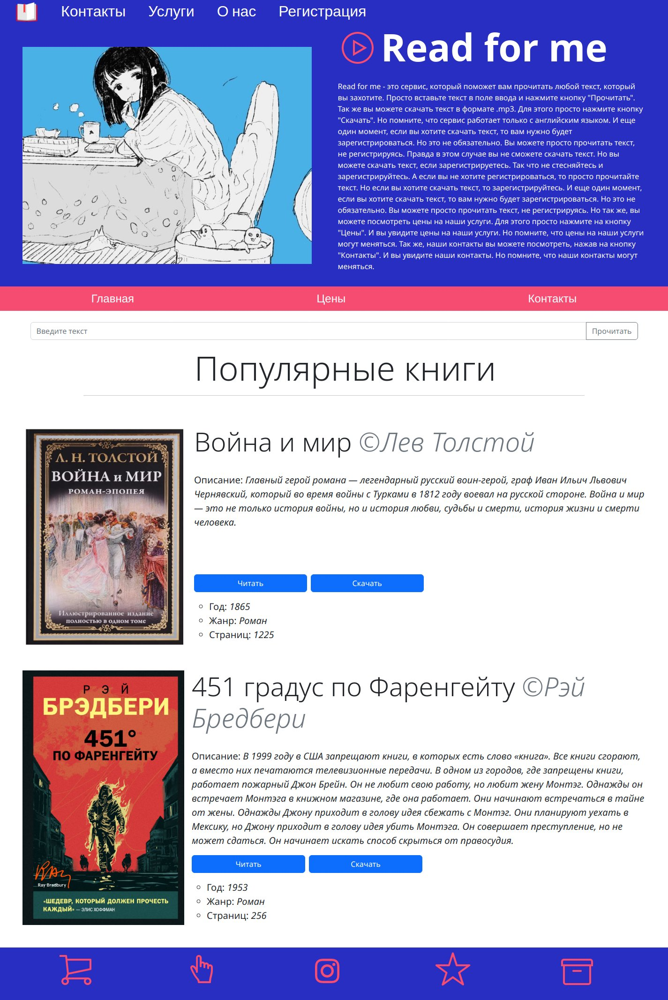

## Read for me [Ru]
Read for me - это сервис, который поможет вам прочитать любой текст, который вы захотите. Просто вставьте текст в поле ввода и нажмите кнопку "Прочитать". Так же вы можете скачать текст в формате .mp3. Для этого просто нажмите кнопку "Скачать". Но помните, что сервис работает только с английским языком. И еще один момент, если вы хотите скачать текст, то вам нужно будет зарегистрироваться. Но это не обязательно. Вы можете просто прочитать текст, не регистрируясь.
## Read for me [En]
Read for me is a service that will help you read any text you want. Just paste the text into the input field and click the "Read" button. You can also download the text in .mp3 format. To do this, just click the "Download" button. But remember that the service works only with the English language. And another point, if you want to download the text, you will need to register. But it is not mandatory. You can just read the text without registering.

## How to use
1. Clone this repository
2. go mod tidy 
3. Run `go run cmd/app/main.go` or `go build cmd/app/main.go` and run the binary file
4. Open `http://localhost:8080` in your browser
5. Enjoy

## How to use with Docker
1. Clone this repository
2. Run `docker build -t readforme .`
3. Run `docker run -p 8080:8080 readforme`
4. Open `http://localhost:8080` in your browser
5. Enjoy

## Languages
- [x] Russian
- [ ] English
- [ ] German
- [ ] Japanese

## Progress
- [x] Frontend [30%]
- [x] Backend [10%]
- [x] Database [5%]
- [ ] Deploy

## Technologies
- [x] Golang
- [x] Gin
- [x] Bootstrap
- [ ] React
- [ ] MongoDB
- [ ] Docker

## Screenshots
- 